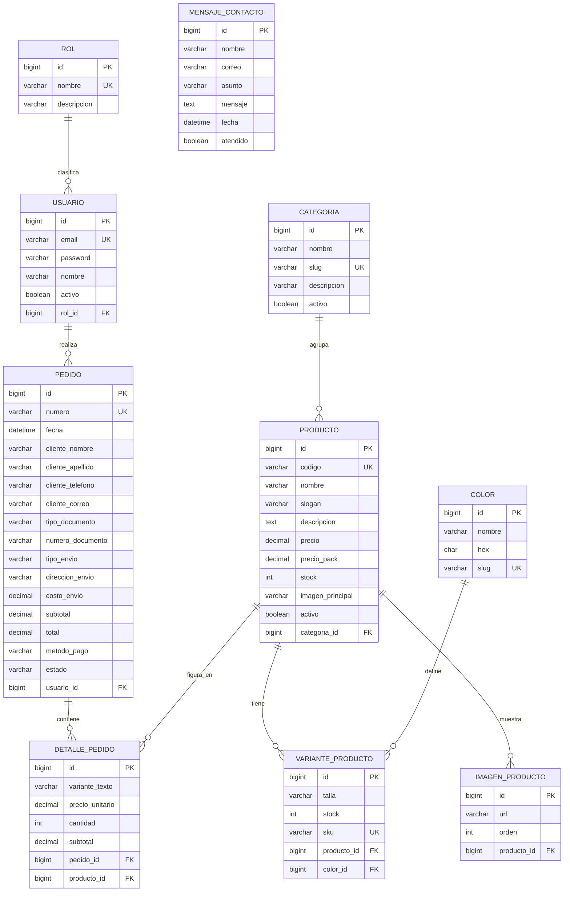

# data-model.md — Modelo de datos de OverText

**Fase SDD:** Plan
**Diseñado en:** Sprint 1 (lo exige el informe del ATF1: *diagrama físico de la base de datos*)
**Implementado en:** ATF3 (`categoria`, `producto`, `color`) y TF (el resto)
**Motor:** MySQL 8 · InnoDB · `utf8mb4_unicode_ci`

> Alimenta la sección **2.3 Diseño de la base de datos** del informe, y el **diccionario de datos** del TF.

---

## 1. Diagrama físico

> **E1-22 (Sprint 1, Jonathan):** el diagrama físico entregable y su DDL viven en
> `esquema-fisico.sql` (definición autoritativa: tipos, PK/FK/UK, `ON DELETE`,
> `CHECK` e índices) y `diagrama-fisico-bd.md` (cómo leerlo).
> La figura para el informe §2.3 es
> `informes/capturas/sprint-01/diagrama-fisico-bd.svg`.
> El diagrama de abajo es la **vista lógica de referencia**; si discrepa del `.sql`,
> gana el `.sql`.

---

## 2. Diccionario de datos

### 2.1 `categoria` — agrupa productos por submarca o línea *(ATF3)*

| Campo | Tipo | Nulo | Restricciones | Descripción |
|---|---|:-:|---|---|
| `id` | BIGINT | No | PK, AUTO_INCREMENT | Identificador |
| `nombre` | VARCHAR(60) | No | `@NotBlank`, `@Size(3,60)` | Nombre visible (p. ej. "Overcoming") |
| `slug` | VARCHAR(60) | No | UNIQUE, `@NotBlank` | Identificador para URL |
| `descripcion` | VARCHAR(255) | Sí | `@Size(max=255)` | Descripción breve |
| `activo` | BOOLEAN | No | DEFAULT TRUE | Si se muestra en el sitio |

### 2.2 `producto` — prenda del catálogo *(ATF3, CRUD completo)*

| Campo | Tipo | Nulo | Restricciones | Descripción |
|---|---|:-:|---|---|
| `id` | BIGINT | No | PK, AUTO_INCREMENT | Identificador |
| `codigo` | VARCHAR(40) | No | UNIQUE, `@NotBlank` | Código de negocio (`short-beige`) |
| `nombre` | VARCHAR(100) | No | `@NotBlank`, `@Size(3,100)` | "SHORT STONE BEIGE" |
| `slogan` | VARCHAR(150) | Sí | `@Size(max=150)` | Frase corta de marca |
| `descripcion` | TEXT | Sí | `@Size(max=500)` | Descripción, máximo 3 líneas |
| `precio` | DECIMAL(10,2) | No | `@NotNull`, `@DecimalMin("0.01")` | Precio unitario (S/ 20.00) |
| `precio_pack` | DECIMAL(10,2) | Sí | `@DecimalMin("0.00")` | Precio del pack de 6 (S/ 100.00) |
| `stock` | INT | No | `@NotNull`, `@Min(0)` | Unidades disponibles |
| `imagen_principal` | VARCHAR(255) | Sí | `@Size(max=255)` | Ruta de la imagen |
| `activo` | BOOLEAN | No | DEFAULT TRUE | Si se publica |
| `categoria_id` | BIGINT | No | FK → `categoria(id)`, `@NotNull` | Categoría |

> El badge de stock ("últimas unidades") se **calcula** desde `stock`, no se guarda: artículo 7 de la constitución. Umbral: **`stock < 10`** (decisión del PO, spec I3, 2026-08-25).

### 2.3 `color` — colores disponibles *(ATF3)*

| Campo | Tipo | Nulo | Restricciones | Descripción |
|---|---|:-:|---|---|
| `id` | BIGINT | No | PK, AUTO_INCREMENT | Identificador |
| `nombre` | VARCHAR(40) | No | `@NotBlank` | "Stone Beige" |
| `hex` | CHAR(7) | No | `@Pattern("^#[0-9A-Fa-f]{6}$")` | `#C4A882` |
| `slug` | VARCHAR(40) | No | UNIQUE | Coincide con la carpeta de imágenes |

### 2.4 `variante_producto` — combinación producto × color × talla *(TF)*

| Campo | Tipo | Nulo | Restricciones | Descripción |
|---|---|:-:|---|---|
| `id` | BIGINT | No | PK, AUTO_INCREMENT | Identificador |
| `talla` | VARCHAR(4) | No | `@NotBlank` | S, M, L, XL |
| `stock` | INT | No | `@Min(0)` | Stock de esa combinación |
| `sku` | VARCHAR(40) | No | UNIQUE | Código de inventario |
| `producto_id` | BIGINT | No | FK → `producto(id)` | Producto |
| `color_id` | BIGINT | No | FK → `color(id)` | Color |

> Normaliza el campo `variante` del carrito actual, que hoy es un texto concatenado (`"STONE BEIGE · TALLA M"`).

### 2.5 `imagen_producto` — galería *(TF)*

| Campo | Tipo | Nulo | Restricciones | Descripción |
|---|---|:-:|---|---|
| `id` | BIGINT | No | PK, AUTO_INCREMENT | Identificador |
| `url` | VARCHAR(255) | No | `@NotBlank` | Ruta de la imagen |
| `orden` | INT | No | `@Min(1)` | Posición en la galería |
| `producto_id` | BIGINT | No | FK → `producto(id)` | Producto |

### 2.6 `rol` *(TF)*

| Campo | Tipo | Nulo | Restricciones | Descripción |
|---|---|:-:|---|---|
| `id` | BIGINT | No | PK, AUTO_INCREMENT | Identificador |
| `nombre` | VARCHAR(20) | No | UNIQUE, `@NotBlank` | `ADMIN`, `CLIENTE` |
| `descripcion` | VARCHAR(100) | Sí | | Descripción del rol |

### 2.7 `usuario` *(TF)*

| Campo | Tipo | Nulo | Restricciones | Descripción |
|---|---|:-:|---|---|
| `id` | BIGINT | No | PK, AUTO_INCREMENT | Identificador |
| `email` | VARCHAR(120) | No | UNIQUE, `@Email`, `@NotBlank` | Usuario de acceso |
| `password` | VARCHAR(72) | No | `@NotBlank` | **Hash BCrypt**, nunca texto plano |
| `nombre` | VARCHAR(80) | No | `@NotBlank` | Nombre para mostrar |
| `activo` | BOOLEAN | No | DEFAULT TRUE | Si puede iniciar sesión |
| `rol_id` | BIGINT | No | FK → `rol(id)`, `@NotNull` | Rol asignado |

### 2.8 `pedido` *(TF)*

| Campo | Tipo | Nulo | Restricciones | Descripción |
|---|---|:-:|---|---|
| `id` | BIGINT | No | PK, AUTO_INCREMENT | Identificador |
| `numero` | VARCHAR(20) | No | UNIQUE | `OT-2026-0001` |
| `fecha` | DATETIME | No | `@NotNull` | Fecha y hora del pedido |
| `cliente_nombre` | VARCHAR(60) | No | `@NotBlank` | Nombre |
| `cliente_apellido` | VARCHAR(60) | No | `@NotBlank` | Apellido |
| `cliente_telefono` | VARCHAR(15) | No | `@Pattern("^[0-9]{9}$")` | Teléfono |
| `cliente_correo` | VARCHAR(120) | No | `@Email` | Correo |
| `tipo_documento` | VARCHAR(10) | No | | DNI, CE, Pasaporte, RUC |
| `numero_documento` | VARCHAR(15) | No | `@NotBlank` | DNI 8 · RUC 11 · CE/Pas. 6-12 |
| `tipo_envio` | VARCHAR(15) | No | | recojo, delivery, provincia |
| `direccion_envio` | VARCHAR(255) | Sí | | Dirección o agencia |
| `costo_envio` | DECIMAL(10,2) | No | `@DecimalMin("0.00")` | 0 · 15 · 25 |
| `subtotal` | DECIMAL(10,2) | No | `@DecimalMin("0.00")` | Suma de los detalles |
| `total` | DECIMAL(10,2) | No | `@DecimalMin("0.00")` | subtotal + costo_envio |
| `metodo_pago` | VARCHAR(15) | No | | deposito, yape |
| `estado` | VARCHAR(15) | No | DEFAULT 'PENDIENTE' | PENDIENTE, PAGADO, ENVIADO, ENTREGADO |
| `usuario_id` | BIGINT | **Sí** | FK → `usuario(id)` | Nulo si compró como invitado |

### 2.9 `detalle_pedido` *(TF)*

| Campo | Tipo | Nulo | Restricciones | Descripción |
|---|---|:-:|---|---|
| `id` | BIGINT | No | PK, AUTO_INCREMENT | Identificador |
| `variante_texto` | VARCHAR(80) | No | | "STONE BEIGE · TALLA M" |
| `precio_unitario` | DECIMAL(10,2) | No | `@DecimalMin("0.01")` | Precio al momento de comprar |
| `cantidad` | INT | No | `@Min(1)` | Unidades |
| `subtotal` | DECIMAL(10,2) | No | `@DecimalMin("0.01")` | precio × cantidad |
| `pedido_id` | BIGINT | No | FK → `pedido(id)` ON DELETE CASCADE | Pedido |
| `producto_id` | BIGINT | No | FK → `producto(id)` | Producto |

> `precio_unitario` se copia al comprar: si el precio del producto cambia después, el pedido histórico no se altera.

### 2.10 `mensaje_contacto` *(TF)*

| Campo | Tipo | Nulo | Restricciones | Descripción |
|---|---|:-:|---|---|
| `id` | BIGINT | No | PK, AUTO_INCREMENT | Identificador |
| `nombre` | VARCHAR(60) | No | `@NotBlank` | Quien escribe |
| `correo` | VARCHAR(120) | No | `@Email` | Correo de respuesta |
| `asunto` | VARCHAR(120) | No | `@NotBlank` | Asunto |
| `mensaje` | TEXT | No | `@NotBlank`, `@Size(10,1000)` | Contenido |
| `fecha` | DATETIME | No | | Fecha de recepción |
| `atendido` | BOOLEAN | No | DEFAULT FALSE | Si ya se respondió |

---

## 3. Datos semilla

De `app-estatico/js/productos.json`:

| codigo | nombre | color | hex | precio |
|---|---|---|---|---|
| `short-beige` | SHORT STONE BEIGE | Stone Beige | `#C4A882` | 20.00 |
| `short-negro` | SHORT NEGRO | Negro | `#111111` | 20.00 |
| `short-guinda` | SHORT GUINDA | Guinda | `#8B1A2C` | 20.00 |
| `short-gris` | SHORT GRIS | Gris | `#9E9E9E` | 20.00 |
| `short-oliva` | SHORT OLIVA | Oliva | `#5C6B3A` | 20.00 |
| `short-azul` | SHORT AZUL | Azul | `#1A3A7A` | 20.00 |
| `short-marron` | SHORT MARRÓN | Marrón | `#6B4A2E` | 20.00 |

Todos: `precio_pack = 100.00` (pack de 6), categoría "Overcoming", tallas S/M/L/XL.

Roles iniciales: `ADMIN`, `CLIENTE`.

---

## 4. Reglas de negocio

| # | Regla | Origen |
|---|---|---|
| RN1 | Precio unitario S/ 20; pack de exactamente 6 prendas por S/ 100 | `promotions.html` |
| RN2 | Costos de envío: recojo S/ 0 · delivery Lima S/ 15 · provincia S/ 25 | `js/checkout.js` |
| RN3 | Envío gratis sobre **S/ 200** (decisión del PO, 2026-08-25) | spec I2 |
| RN4 | Validación de documento: DNI 8 dígitos · RUC 11 · CE/Pasaporte 6-12 alfanumérico | `js/checkout.js` |
| RN5 | El badge de stock se calcula desde `producto.stock` — **umbral `stock < 10`** (PO, 2026-08-25) | spec I3 |
| RN6 | Un pedido guarda el precio del momento; los cambios posteriores no lo afectan | decisión de diseño |

---

## 5. Decisiones de modelado

| # | Decisión | Motivo |
|---|---|---|
| M1 | El ubigeo (25 departamentos, 43 distritos) **no se modela**: sigue como JSON estático | Artículo 8: ninguna rúbrica lo pide |
| M2 | `pedido` guarda los datos del cliente desnormalizados | El 90 % de las compras son de invitados; `usuario_id` es opcional |
| M3 | El ATF3 implementa solo `categoria` + `producto` | La rúbrica pide 2 tablas con FK y CRUD completo en una |
| M4 | El badge de stock se calcula, no se almacena | Artículo 7: un solo origen de verdad |
| M5 | `variante_producto` se pospone al TF | El ATF3 no necesita esa granularidad |
