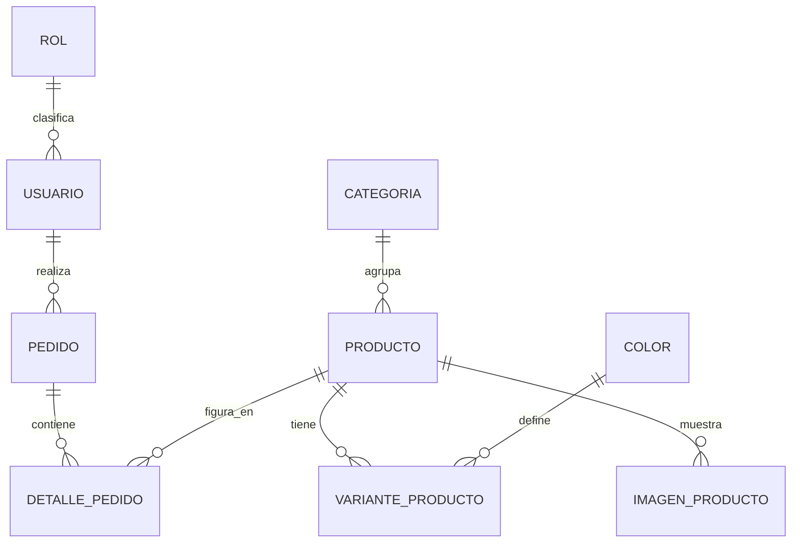

# diagrama-fisico-bd.md — Diagrama físico de la base de datos

**Historia:** E1-22 · **Sprint:** 1 · **Criterio de rúbrica:** ATF1-3 (y ATF2-3, ATF3-3, TF-3)
**Autor:** Jonathan (duo Datos, con Carlos) · **Fecha:** 2026-08-26
**Fuente lógica:** `data-model.md` · **Forma física:** `esquema-fisico.sql`

> Las **cuatro** rúbricas piden el diagrama físico dentro del informe. Se dibuja
> una vez aquí y se actualiza; no se vuelve a redibujar en cada avance.

---

## 1. Qué entrega esta historia

| Archivo | Para qué sirve |
|---|---|
| `esquema-fisico.sql` | El DDL de MySQL 8: tipos, PK, FK, UK, CHECK, índices y datos semilla. **Es la definición autoritativa.** |
| `informes/capturas/sprint-01/diagrama-fisico-bd.svg` | El diagrama para insertar en el informe §2.3 (vectorial, no pixela al imprimir). |
| `informes/capturas/sprint-01/diagrama-fisico-bd.png` | El mismo diagrama en mapa de bits, por si el exportador a `.docx`/PDF no acepta SVG. |
| Este archivo | Cómo leerlo y por qué está así. |

**Para el duo del documento (E1-21):** en la sección 2.3 del informe va la imagen
`informes/capturas/sprint-01/diagrama-fisico-bd.svg` con el pie
*«Figura N. Diagrama físico de la base de datos. Fuente: elaboración propia.»*
El diccionario de datos (§2.3.1) sale de `data-model.md` §2 y es del TF.

---

## 2. Por qué es *físico* y no lógico

El diagrama lógico dice *qué* entidades hay. El físico dice **cómo quedan en el motor**.
Este cumple lo segundo:

- **Motor declarado:** MySQL 8, InnoDB, `utf8mb4_unicode_ci`.
- **Tipos SQL reales**, no conceptuales: `BIGINT AUTO_INCREMENT`, `VARCHAR(n)` con
  su longitud, `DECIMAL(10,2)` para dinero (nunca `FLOAT`), `DATETIME`, `TEXT`.
- **Claves marcadas una por una:** PK, FK, UK.
- **Nulabilidad explícita**, incluido el único FK opcional (`pedido.usuario_id`).
- **Cardinalidad** en cada relación: `1` en el lado padre, pata de gallo y `N` en el hijo.
- **Reglas de integridad** en el DDL: `ON DELETE` por relación y `CHECK` de montos y stock.

---

## 3. Las 10 tablas y cuándo se implementan

| Tabla | Fase | Motivo |
|---|:-:|---|
| `categoria` | ATF3 | La rúbrica del ATF3 pide 2 tablas con FK entre ellas |
| `producto` | ATF3 | Es la del CRUD completo |
| `color` | ATF3 | Cierra la paleta del catálogo como dato, no como texto suelto |
| `variante_producto` | TF | Producto × color × talla; el ATF3 no necesita esa granularidad (M5) |
| `imagen_producto` | TF | Galería de la ficha |
| `rol` | TF | Llega con Spring Security |
| `usuario` | TF | Llega con Spring Security |
| `pedido` | TF | Sustituye a `ot_pedido` en `localStorage` (spec I4) |
| `detalle_pedido` | TF | Líneas del pedido |
| `mensaje_contacto` | TF | Bandeja del formulario de contacto |

---

## 4. Relaciones y borrado

| Padre | Hijo | Clave foránea | Card. | `ON DELETE` | Por qué |
|---|---|---|:-:|---|---|
| `categoria` | `producto` | `categoria_id` | 1:N | `RESTRICT` | Borrar una categoría con productos dejaría huérfanos |
| `producto` | `variante_producto` | `producto_id` | 1:N | `CASCADE` | La variante no existe sin su producto |
| `color` | `variante_producto` | `color_id` | 1:N | `RESTRICT` | El color es catálogo maestro |
| `producto` | `imagen_producto` | `producto_id` | 1:N | `CASCADE` | La imagen no existe sin su producto |
| `rol` | `usuario` | `rol_id` | 1:N | `RESTRICT` | No se borra un rol que alguien usa |
| `usuario` | `pedido` | `usuario_id` **(nulo)** | 1:N | `SET NULL` | El pedido sobrevive a la baja del usuario: es un registro contable |
| `pedido` | `detalle_pedido` | `pedido_id` | 1:N | `CASCADE` | El detalle no existe sin su pedido |
| `producto` | `detalle_pedido` | `producto_id` | 1:N | `RESTRICT` | No se borra un producto que figura en un pedido histórico |

`mensaje_contacto` no participa en ninguna relación: es una bandeja independiente.

---

## 5. Índices, y por qué esos

Toda FK lleva índice (InnoDB lo necesita para verificar la integridad). Además:

| Índice | Consulta que acelera |
|---|---|
| `ix_producto_activo` | El catálogo público, que solo lista productos activos |
| `ix_imagen_producto (producto_id, orden)` | La galería de la ficha, ya ordenada |
| `ix_pedido_fecha` · `ix_pedido_estado` | El panel de pedidos del administrador |
| `ix_mensaje_atendido (atendido, fecha)` | La bandeja: primero lo no atendido, por fecha |
| `uk_variante_combinacion (producto_id, color_id, talla)` | Impide dos filas para la misma combinación |

---

## 6. Decisiones que se ven en el diagrama

1. **El badge «últimas unidades» no es una columna.** Se calcula con `producto.stock < 10`.
   Guardarlo sería duplicar un dato: constitución art. 7, decisión del PO del 2026-08-25 (spec I3).
2. **`pedido` guarda los datos del cliente desnormalizados** y `usuario_id` es nulo:
   la mayoría de compras son de invitado (M2).
3. **`detalle_pedido.precio_unitario` congela el precio del momento** (RN6). Si el
   precio del producto cambia después, el pedido histórico no se altera.
4. **El dinero es `DECIMAL(10,2)`**, nunca coma flotante: `FLOAT` pierde céntimos.
5. **No se modela el ubigeo** (25 departamentos, 43 distritos): sigue como JSON estático.
   Ninguna rúbrica lo pide y añadirlo violaría el art. 8 (M1).
6. **No se carga el color BLANCO** del configurador de packs: no existe como producto (spec I1).

---

## 7. Cómo se regenera el diagrama

El SVG se generó por script a partir de la misma definición del DDL, para que el
dibujo y el esquema no se separen. Si cambia una tabla:

1. Se edita `esquema-fisico.sql` (es la fuente autoritativa).
2. Se refleja el cambio en `data-model.md` §2.
3. Se vuelve a generar el SVG y se sustituye la figura del informe.

---

## 8. Vista de referencia

Copia en Mermaid del mismo diagrama, para leerlo dentro de GitHub sin abrir la imagen.
Si discrepa del SVG o del `.sql`, **gana `esquema-fisico.sql`**.

