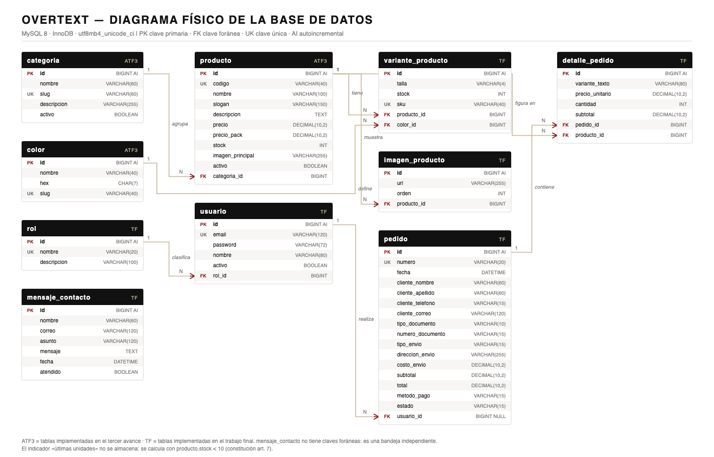

# Informe del proyecto — OverText

> **Documento vivo.** Se escribe en Markdown y se exporta a `.docx` (con la Plantilla UTP) y a `.pdf` solo al empaquetar cada entrega. **Nunca se edita el `.docx`** — constitución art. 10.
>
> Estructura basada en `../../estructura_documento/Documento_Proyecto_UTP.md`, con tres secciones añadidas que la plantilla no traía y el Trabajo Final sí exige: **Docente** en la portada, **Recomendaciones** y **Anexos**.
>
> Marcas: `[ATF1]` `[ATF2]` `[ATF3]` `[TF]` indican en qué avance debe estar lista cada sección. `⬜` = por redactar.

---

## Portada

**Universidad Tecnológica del Perú**
Facultad de Ingeniería de Sistemas y Electrónica

**Tema del proyecto**
OverText — Plataforma de comercio electrónico para streetwear peruano

**Integrantes:**
- Joaquín ⬜ *(apellidos)*
- José ⬜
- Jonathan Tuppia Lozano
- Dayro ⬜
- Carlos ⬜
- Jhade ⬜

**Docente:** ⬜ *(añadido: la plantilla original no traía este campo y el TF lo exige)*

**Curso:** Marcos de Desarrollo Web — Sección 38189

**Grupo:** 01

**Lima – Perú, 2026**

---

## ÍNDICE

- [INTRODUCCIÓN](#introducción) `[ATF3]`
- [CAPÍTULO 1: GENERALIDADES](#capítulo-1-generalidades)
  - [1.1 Situación problemática](#11-situación-problemática) `[ATF1]`
  - [1.2 Objetivos](#12-objetivos) `[ATF1]`
- [CAPÍTULO 2: DESARROLLO DEL PROYECTO DE SOFTWARE](#capítulo-2-desarrollo-del-proyecto-de-software)
  - [2.1 Resumen ejecutivo](#21-resumen-ejecutivo) `[ATF1]`
  - [2.2 Requisitos](#22-requisitos) `[ATF1]`
  - [2.3 Diseño de la base de datos](#23-diseño-de-la-base-de-datos) `[ATF1]`
  - [2.4 Resultados](#24-resultados) `[ATF1]`
- [OBSERVACIONES](#observaciones) `[TF]`
- [CONCLUSIONES](#conclusiones) `[TF]`
- [RECOMENDACIONES](#recomendaciones) `[TF]`
- [BIBLIOGRAFÍA](#bibliografía) `[TF]`
- [ANEXOS](#anexos) `[TF]`

---

## INTRODUCCIÓN

`[ATF3]` ⬜

---

## CAPÍTULO 1: GENERALIDADES

### 1.1 Situación problemática

`[ATF1]` ⬜ — **Fuente:** `docs/specs/001-sitio-bootstrap/spec.md` §1. Trasladar y redactar en prosa.

### 1.2 Objetivos

#### 1.2.1 General

`[ATF1]` ⬜ — **Fuente:** `spec.md` §2.1.

#### 1.2.2 Específicos

`[ATF1]` ⬜ — **Fuente:** `spec.md` §2.2 (cinco objetivos).

---

## CAPÍTULO 2: DESARROLLO DEL PROYECTO DE SOFTWARE

### 2.1 Resumen ejecutivo

#### 2.1.1 Reseña

`[ATF1]` ⬜ — Quién es OverText: empresa peruana de streetwear masculino, fabricante directo, submarca Overcoming. **Fuente:** `docs/contexto.md` §01 y §10.

#### 2.1.2 Descripción de la solución planteada

`[ATF1]` ⬜ — **Fuente:** `docs/specs/001-sitio-bootstrap/plan.md`. Abrir con: *«La solución planteada fue la de crear una aplicación web para alcanzar los siguientes objetivos o brindando las siguientes funcionalidades…»* y listar.

##### 2.1.2.1 Tecnologías usadas

`[TF]` ⬜ — Lenguajes, bibliotecas, programas y herramientas: Java, HTML, CSS, JavaScript, Bootstrap 5.3, Spring Boot 3.x, Spring Web, Thymeleaf, Spring Data JPA, Hibernate, Spring Security, MySQL 8, Maven, Git.

##### 2.1.2.2 Descripción técnica del funcionamiento

`[TF]` ⬜ — Arquitectura por capas, diagramas UML. Esta sección **debe invocar a los ANEXOS**.

### 2.2 Requisitos

`[ATF1]` ⬜ — **Fuente:** `spec.md` §4. Copiar las dos tablas.

**Requisitos funcionales del sistema**

| Código | Nombre |
| :--- | :--- |
| RQF-0001 | ⬜ |

*Fuente: elaboración propia.*

**Requisitos no funcionales**

| Código | Descripción |
| :--- | :--- |
| RNF-0001 | ⬜ |

*Fuente: elaboración propia.*

### 2.3 Diseño de la base de datos

`[ATF1]` ⬜ — **Fuente:** `docs/specs/001-sitio-bootstrap/data-model.md`. Falta el texto que acompaña a la figura (E1-21).

**Figura 1.** Diagrama físico de la base de datos de OverText — 10 tablas, MySQL 8 / InnoDB.

*Fuente: elaboración propia.*

> E1-22 ✅ — El diagrama se **genera por script** desde `docs/specs/001-sitio-bootstrap/esquema-fisico.sql`, que es la definición autoritativa del modelo. Si una tabla cambia, se vuelve a exportar; no se redibuja a mano. Para el `.docx` usar el `.png`; el `.svg` es el original vectorial y no pixela al imprimir.

#### 2.3.1 Diccionario de datos

`[TF]` ⬜ — **Fuente:** `data-model.md` §2. Tabla por tabla, con tipo, nulidad, restricciones y descripción.

### 2.4 Resultados

`[ATF1]` ⬜ — Capturas del sitio funcionando en el navegador, **una por página**, más la **foto de la estructura del proyecto**. Archivo: `informes/capturas/sprint-0N/`.

---

## OBSERVACIONES

`[TF]` ⬜

## CONCLUSIONES

`[TF]` ⬜

## RECOMENDACIONES

`[TF]` ⬜ — *(sección añadida: la plantilla original no la traía y el TF la exige por separado de OBSERVACIONES)*

## BIBLIOGRAFÍA

`[TF]` ⬜ — **Vaciada por completo.** La plantilla original traía ~60 referencias de otro proyecto (Android y acoso escolar) que no tienen relación con este trabajo. Redactar solo las fuentes realmente consultadas: documentación de Spring, Bootstrap, Thymeleaf, MySQL, y la bibliografía base del sílabo.

## ANEXOS

`[TF]` ⬜ — *(sección añadida: la plantilla original no la traía y el TF la exige)*

- **Anexo A** — Código fuente
- **Anexo B** — Capturas de pantalla del funcionamiento
- **Anexo C** — Imágenes de la estructura del proyecto

---

> **Nota de limpieza.** De la plantilla original se eliminó todo el contenido de ejemplo ajeno a este proyecto: los requisitos de un sistema de convivencia escolar (reportar casos e incidencias), las tablas `gender`, `user`, `section`, `level`, `role`, `grade`, `case`, `information`, `incident`, `status`, y la bibliografía completa. Dejar cualquier resto se nota en la sustentación.
